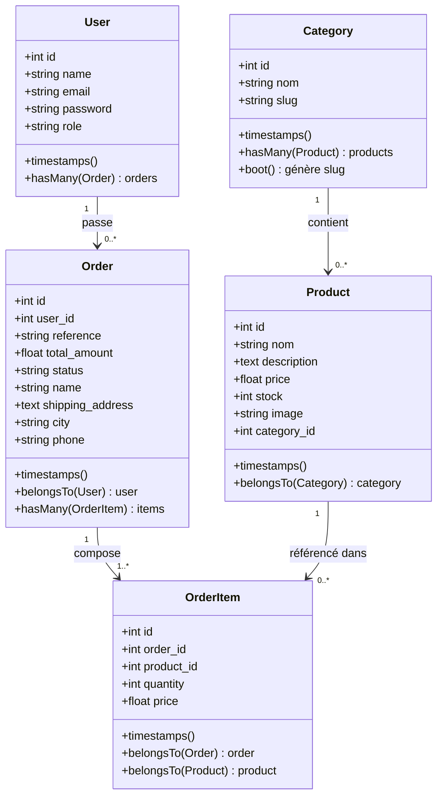
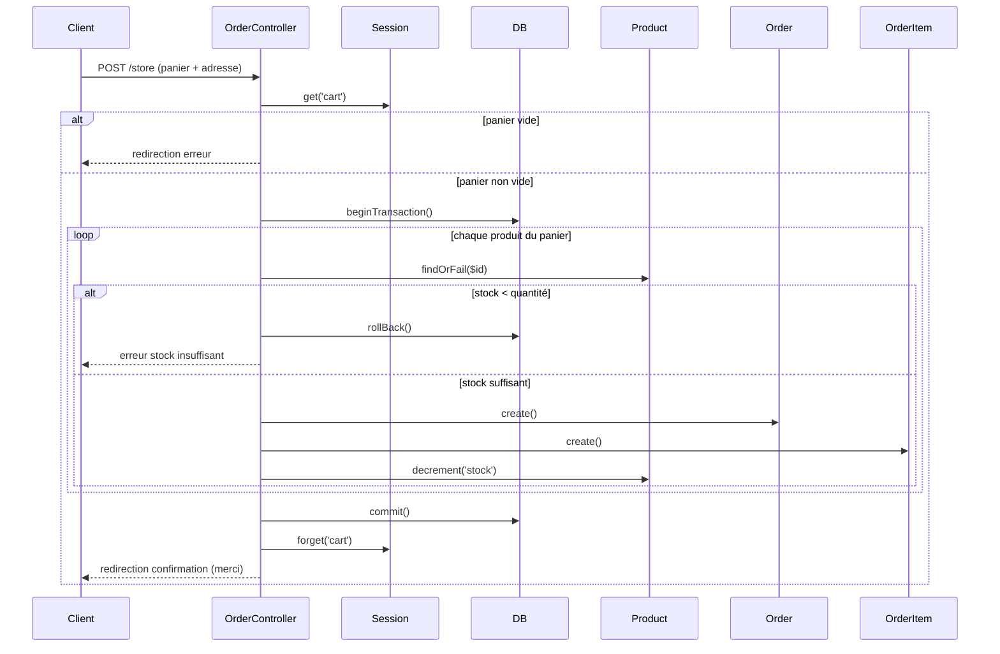
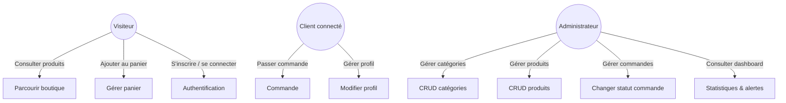
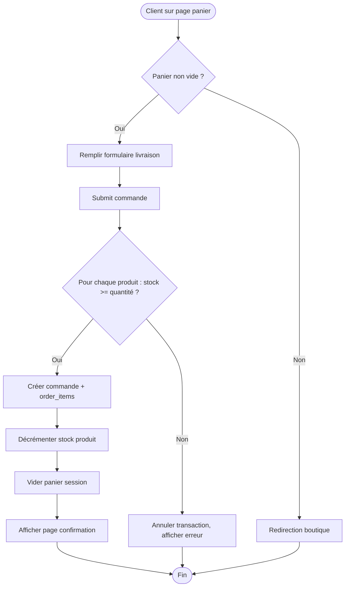

## Rapport détaillé du projet : **Moroccan Basket** (Plateforme e-commerce d’artisanat marocain)

### 1. Introduction
**Moroccan Basket** est une application web e-commerce développée avec **Laravel** (PHP). Elle permet aux clients de parcourir des produits artisanaux (soins naturels, art de la table, artisanat), de les ajouter à un panier, de passer commande et de gérer leur profil. Un espace administrateur sécurisé offre la gestion complète des produits, catégories et commandes.

---

### 2. Architecture technique
| Composant      | Technologie                                      |
|----------------|--------------------------------------------------|
| Backend        | PHP 8.x / Laravel 10+                            |
| Base de données| MySQL / MariaDB (Eloquent ORM)                   |
| Frontend       | Blade templates + CSS personnalisé               |
| Authentification | Laravel Breeze / Jetstream (via `auth.php`)    |
| Stockage images| Système de fichiers local (`storage/app/public/products`) |
| Session        | Stockage du panier en session (`session()->get('cart')`) |

---

### 3. Fonctionnalités principales

#### 3.1 Côté client (visiteur / utilisateur connecté)
- **Boutique** : affichage des produits par catégorie, pagination (6 produits/page), recherche par nom.
- **Détail produit** : affichage d’un produit avec sa catégorie, sélection de quantité, ajout au panier.
- **Panier** : consultation, modification des quantités, suppression d’articles, calcul du total.
- **Passage de commande** : formulaire d’adresse de livraison, validation du stock en transaction, création de la commande et des `order_items`, décrémentation du stock, vidage du panier.
- **Espace client** : modification du profil et suppression du compte.

#### 3.2 Côté administrateur
- **Dashboard** : statistiques (nombre de commandes, chiffre d’affaires, total produits, catégories, valeur du stock, alertes stock faible).
- **Gestion des catégories** : CRUD complet, génération automatique du slug, suppression protégée si des produits sont liés.
- **Gestion des produits** : CRUD complet, upload d’image, suppression de l’ancienne image lors de la mise à jour, validation de la catégorie.
- **Gestion des commandes** : liste paginée, détail d’une commande (avec items et infos client), mise à jour du statut (`en_attente`, `expédiée`, `livrée`, `annulée`).

---

### 4. Structure des fichiers (MVC)

#### 4.1 Modèles (Models)
- `User` : `name`, `email`, `password`, `role` (admin/client)
- `Category` : `nom`, `slug`, relation `hasMany(Product::class)`. Boot pour générer le slug.
- `Product` : `nom`, `description`, `price`, `stock`, `image`, `category_id` (clé étrangère), relation `belongsTo(Category::class)`.
- `Order` : `user_id`, `reference`, `total_amount`, `status`, `name`, `shipping_address`, `city`, `phone`. Relations `hasMany(OrderItem::class)` et `belongsTo(User::class)`.
- `OrderItem` : `order_id`, `product_id`, `quantity`, `price`. Relations `belongsTo(Order::class)` et `belongsTo(Product::class)`.

#### 4.2 Contrôleurs (Controllers)
- **Admin** :
  - `DashboardController` : statistiques, liste des commandes, détail et changement de statut.
  - `CategoryController` : CRUD catégories.
  - `ProductController` : CRUD produits, gestion d’images.
- **Front** :
  - `ShopController` : boutique, affichage produit.
  - `CartController` : panier (session).
  - `OrderController` : checkout, validation commande (transaction DB).
  - `ProfileController` : gestion du profil utilisateur.

#### 4.3 Middleware
- `IsAdmin` : vérifie que l’utilisateur connecté a le rôle `admin`, sinon redirige vers la boutique.

#### 4.4 Routes (web.php)
- **Routes publiques** : `/` (boutique), `/product/{id}`, `/cart`, `/cart/add/{id}`, `/cart/remove/{id}`.
- **Routes protégées (auth)** : `/checkout`, `/store`, `/merci`, `/profile`, `/my-account`.
- **Routes admin (auth + is_admin)** : préfixe `/admin` → dashboard, ressources `products`, `categories`, gestion des commandes (`/admin/orders`).

#### 4.5 Vues (Blade)
- **Layouts** : `layouts/app.blade.php` (front office), `layouts/admin.blade.php` (back office).
- **Front** : `shop/index.blade.php`, `shop/show.blade.php`, `cart/index.blade.php`, `orders/checkout.blade.php`, `orders/confirmation.blade.php`.
- **Admin** : `admin/dashboard.blade.php`, `admin/products/index.blade.php`, `admin/products/create.blade.php`, `admin/products/edit.blade.php`, `admin/orders/index.blade.php`, `admin/orders/show.blade.php`.

---

### 5. Diagramme de classes UML (Mermaid)

---

### 6. Diagramme de séquence – Passer une commande

---

### 7. Diagramme de cas d’utilisation

---

### 8. Diagramme d’activité – Processus de commande

---

### 9. Détails des vues principales

#### 9.1 Front office (`layouts/app.blade.php`)
- Barre de navigation : logo, liens boutique, panier avec compteur, zone login/register/profil/déconnexion.
- Affichage des messages flash (success/error).
- Pied de page.

#### 9.2 Boutique (`shop/index.blade.php`)
- Filtre par catégorie (select avec soumission automatique).
- Grille responsive des produits : image, nom, prix, catégorie, bouton “Découvrir”.
- Pagination Laravel stylisée.

#### 9.3 Panier (`cart/index.blade.php`)
- Liste des produits avec image, nom, prix, quantité, bouton supprimer.
- Total général, bouton “Valider ma commande”.

#### 9.4 Checkout (`orders/checkout.blade.php`)
- Formulaire livraison : nom, email, adresse, ville, téléphone.
- Résumé du panier avec sous-totaux.
- Bouton de confirmation (déclenche `OrderController@store`).

#### 9.5 Confirmation (`orders/confirmation.blade.php`)
- Message de remerciement, affichage de la référence commande (stockée en session `ref`).
- Lien retour boutique.

#### 9.6 Admin dashboard (`admin/dashboard.blade.php`)
- Cartes statistiques (total produits, catégories, valeur stock, alertes).
- Tableau des produits en stock faible (≤5) avec lien vers édition.

#### 9.7 Gestion produits (`admin/products/index.blade.php`)
- Filtres (recherche par nom, catégorie).
- Tableau avec image, nom, catégorie, prix, état stock (couleur selon seuil).
- Actions : modifier, supprimer (avec confirmation JS).

#### 9.8 Gestion commandes (`admin/orders/index.blade.php`)
- Tableau : référence, client, date, montant, statut (badge coloré), bouton “Détails”.
- Pagination.

#### 9.9 Détail commande (`admin/orders/show.blade.php`)
- Affichage des produits commandés (image, nom, prix, quantité, sous-total).
- Formulaire de changement de statut (select + bouton).
- Informations client (nom, téléphone, ville, adresse).

---

### 10. Sécurité et bonnes pratiques

- **Middleware `IsAdmin`** : protège toutes les routes d’administration.
- **Validation des requêtes** : règles `validate()` dans chaque méthode `store`/`update`.
- **Transactions SQL** : garantit l’intégrité des commandes (tout ou rien).
- **Protection contre suppression en cascade** : une catégorie avec produits ne peut être supprimée.
- **Gestion automatique du slug** : via le boot du modèle `Category`.
- **Stockage des mots de passe** : hachés par Laravel.
- **CSRF protection** : active sur tous les formulaires POST/PUT/DELETE.
- **Confirmation JavaScript** avant suppression d’un produit.

---

### 11. Points forts et axes d’amélioration

#### Points forts
- Architecture MVC claire et respect des conventions Laravel.
- Code bien structuré, réutilisable (ex: fonction `handleImageUpload`).
- Expérience utilisateur fluide (messages flash, aperçu image, pagination).
- Gestion robuste des stocks et des commandes.

#### Axes d’amélioration possibles
- **Tests automatisés** : ajouter des tests unitaires et fonctionnels (PHPUnit).
- **API REST** : exposer les produits/commandes pour une éventuelle application mobile.
- **Paiement en ligne** : intégrer Stripe ou PayCenter.
- **Recherche avancée** : ajouter un moteur de recherche full-text.
- **Export PDF** des factures (bibliothèque DomPDF).
- **Notifications par email** à la création/validation de commande.
- **Gestion des quantités dans le panier** : permettre à l’utilisateur de modifier la quantité directement depuis le panier.

---

### 12. Conclusion
Le projet **Moroccan Basket** est une application e-commerce complète, prête à être déployée. Son code suit les meilleures pratiques Laravel, intègre toutes les fonctionnalités essentielles d’une boutique en ligne (catalogue, panier, commande, administration) et met en œuvre des mécanismes de sécurité solides. Les diagrammes fournis (classes, séquence, cas d’utilisation, activité) permettent de visualiser rapidement l’architecture et les flux métier.

